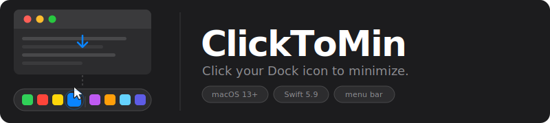

<p align="center">
  
</p>

<p align="center">
  <a href="../../actions/workflows/ci.yml">
    
  </a>
  
  
  
  
</p>

---

**ClickToMin** is a tiny macOS menu bar utility that restores a Dock behavior you didn't know you were missing: clicking the Dock icon of the already-frontmost app minimizes its window.

## How It Works

macOS has three distinct Dock-click states. ClickToMin intercepts only the one that does nothing by default:

| State | Default macOS | With ClickToMin |
|---|---|---|
| App is **backgrounded** | Brings app to front | ← unchanged |
| App is **frontmost**, window visible | Does nothing | **Minimizes the window** |
| App is **frontmost**, all windows minimized | Restores a window | ← unchanged |

A fast-path Dock geometry check short-circuits ~99% of global clicks before any Accessibility API calls are made.

## Features

- No configuration — grant Accessibility permission and it works
- Runs as a menu bar accessory (`LSUIElement`): no Dock icon, no app-switcher entry
- Fast-path geometry check eliminates AX IPC on nearly all clicks
- Per-item 300 ms debounce prevents accidental double-minimize
- Works with every app on every screen
- Handles Dock auto-hide, multi-display layouts, and Dock relaunches

## Requirements

- **macOS 13 Ventura** or later (Apple Silicon or Intel)
- **Accessibility permission** — prompted on first launch and auto-reactivated once granted

## Installation

### Download

1. Download `ClickToMin-vX.X.X.dmg` from the [latest release](../../releases/latest)
2. Open the DMG and drag **ClickToMin** into **Applications**
3. Clear the quarantine flag (see [Installing an unsigned build](#installing-an-unsigned-build) below)
4. Launch **ClickToMin** from Applications
5. Grant Accessibility when prompted — System Settings → Privacy & Security → Accessibility

The `↓` icon appears in your menu bar; ClickToMin is running.

### Installing an unsigned build

ClickToMin releases are **ad-hoc signed**, not signed with a paid Apple Developer ID. macOS Gatekeeper will refuse to launch the app until you clear its quarantine flag. This is a one-time step per install.

**One-line fix (recommended):**

```bash
xattr -dr com.apple.quarantine /Applications/ClickToMin.app
```

**Or, via Finder:** right-click `ClickToMin.app` → **Open** → **Open** in the confirmation dialog. macOS remembers the exception after the first launch.

**Why unsigned?** Apple's Developer ID (which removes Gatekeeper warnings entirely) requires a $99/year Apple Developer Program membership. For a side-project utility that would rather not charge users or accept donations, the tradeoff is the one-line `xattr` step. If you're uncomfortable running unsigned code, building from source (below) produces an identical ad-hoc-signed binary under your own control.

### Build from source

```bash
git clone https://github.com/chrisno/click-to-min.git
cd click-to-min
./build.sh        # produces ClickToMin.app in the project root
open ClickToMin.app
```

Requires: Xcode Command Line Tools, macOS 13+

## Permissions

ClickToMin requires **Accessibility access** in  
**System Settings → Privacy & Security → Accessibility** to:

- Monitor global left-clicks (to detect Dock clicks)
- Read the AX attributes of the clicked Dock item
- Set `AXMinimized` on the frontmost window

Permission is verified on every launch and after every system wake. If access is revoked, the app stops intercepting clicks and polls silently until access is restored. You can revoke it at any time.

## Architecture

ClickToMin uses a strict **Core / I/O** split enforced at compile time by the SwiftPM target boundary. `ClickToMinCore` (pure logic) has no AppKit or ApplicationServices imports, which lets the entire pipeline be exercised with in-memory fakes.

```
GlobalClickMonitor  (CGEventTap, session-wide)
        │
        ▼
   DockWatcher       (coordinator — wires Core ↔ I/O)
        │
        ▼
  runClickPipeline()
   ├─ CoordinateConverter   convert NSEvent origin → AX screen origin
   ├─ DockGeometry          fast-path: is the click inside the Dock frame?
   ├─ AXHitTester           which Dock item was hit?
   ├─ DockPIDCache          confirm the element belongs to the Dock process
   ├─ BundleURLMatcher      does the clicked item match the frontmost app?
   ├─ ClickDebouncer        suppress repeats within 300 ms
   └─ WindowMinimizer       set AXMinimized = true on the key window
```

Zero live AX calls required.

## Development

```bash
# Build
swift build
swift build -c release

# Test
swift test --parallel

# Assemble .app bundle (release)
./build.sh

# Live log stream
log stream --predicate 'subsystem == "com.click-to-min"'
```

## Contributing

Contributions welcome — see [CONTRIBUTING.md](CONTRIBUTING.md) for build, test, lint, and PR workflow.

## License

GPL-3.0-or-later — see [LICENSE](LICENSE).
